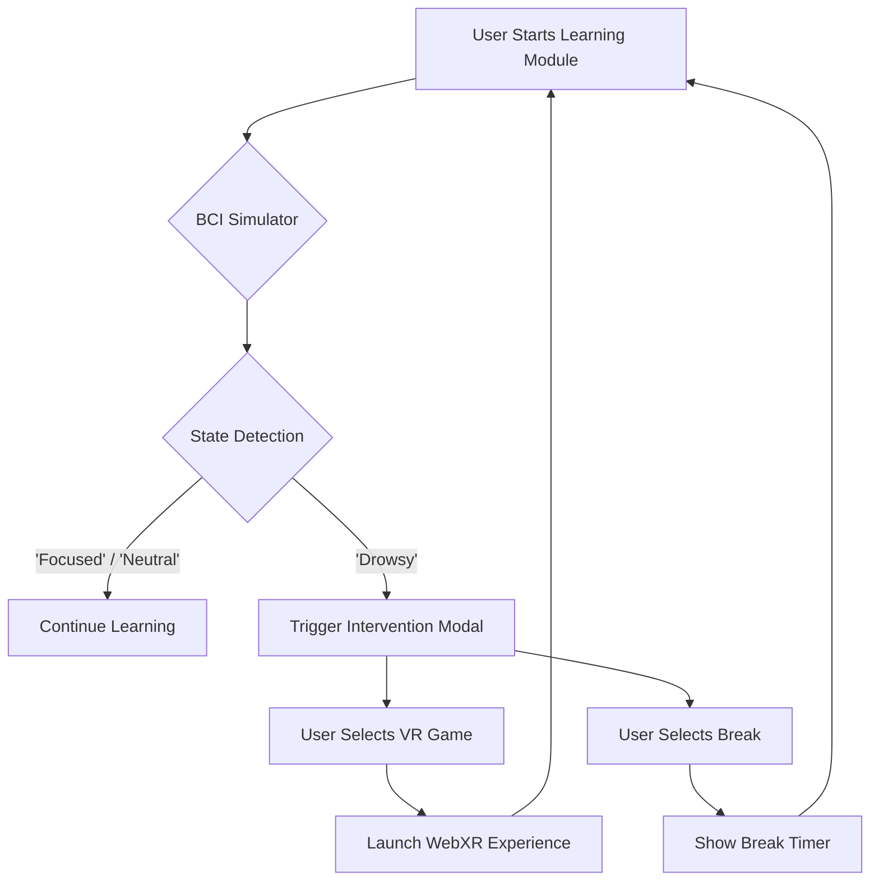

# NallasNeuroAdaptiveLearning
All codes according to the problem statement
<<<<<<< HEAD

# Neuroadaptive EdTech: A NALLAS HACKATHON Submission

**Live Demo:** [Link to your Vercel deployment]

## 1. The Challenge: Beyond Static EdTech

The global EdTech industry, despite its scale, largely remains anchored to static content delivery. The true frontier lies at the intersection of neuroscience and learning technology. This project, created for the **NALLAS Hackathon**, is a prototype for a neuroadaptive learning platform that pushes beyond conventional UX to create a brain-aware educational experience.

**Problem Statement:**
Create an open-source neuroadaptive learning prototype that harnesses real-time brainwave data to trigger creative, context-aware micro-interventions and dynamically generate personalized learning artifacts—such as bespoke analogies, AR/VR experiences, or adaptive quizzes—based on each learner’s cognitive and emotional state.

## 2. Our Solution: NeuroBright

**NeuroBright** is a web-based prototype that simulates a neuroadaptive learning environment. It addresses the challenge by monitoring a user's simulated cognitive state and delivering AI-generated, personalized interventions to enhance focus and memory consolidation.

When the platform detects a drop in focus (a simulated "Drowsy" state), it intervenes with targeted activities designed to re-engage the learner, such as an immersive VR mini-game or a timed break. This creates a dynamic feedback loop between the user's mind and the educational content.

### Key Features

*   **🧠 BCI State Simulation:** To demonstrate the core concept without requiring a physical BCI, the application simulates a real-time EEG data stream. It cycles through **'Focused,' 'Neutral,'** and **'Drowsy'** states during a learning session, providing a realistic foundation for triggering interventions.

*   **🤖 AI-Driven Content Generation:** The platform leverages the **Google Gemini API** to generate course outlines, quizzes, and even educational comics on the fly. This ensures that content is fresh, personalized, and can be adapted to any topic the user wishes to learn.

*   **⚡ Adaptive Interventions:** When the simulated BCI detects a "Drowsy" state, a modal appears, prompting the user with a choice of activities to restore focus. This includes launching a VR game, taking a timed break, or viewing a competitive leaderboard.

*   **🎮 Interactive VR Mini-Game:** Built with **Three.js** and the **WebXR API**, this immersive VR target-shooting game serves as a "subconscious coaching" tool. It's a fun, fast-paced activity designed to quickly re-engage the user's attention and pull them out of a drowsy state.

*   **📚 Optimized & Pre-packaged Content:** To guarantee a seamless and fast demonstration, the prototype includes a comprehensive, pre-packaged course on **"Optics."** This module loads instantly from local data, bypassing API calls while still showcasing the full range of learning modes (Static Text, Video, 3D Visuals, and dynamic Comics).

### Data & Intervention Flow Diagram

This diagram illustrates the flow of data from the simulated BCI to the user-facing intervention.



## 3. Technology Stack

-   **Frontend:** React, Vite, TypeScript, Tailwind CSS
-   **3D/VR:** Three.js, WebXR
-   **AI & Content Generation:** Google Gemini API
-   **Deployment:** Vercel

## 4. Project Structure

```
/
├── public/
├── src/
│   ├── assets/         # Images for static content
│   ├── components/     # Reusable UI components
│   └── features/       # Core application features
│       ├── course-chat/  # Main chat and learning hub logic
│       │   ├── CourseChat.tsx
│       │   └── optics-data.ts  # Pre-packaged course data
│       └── webxr/          # VR mini-game
│           └── WebXRDemo.tsx
├── vercel.json         # Deployment configuration
└── README.md           # You are here!
```

## 5. Ethics & Safety Statement

This prototype is designed with privacy and user comfort as core principles.

*   **Data Privacy:** All BCI data is **simulated entirely on the client-side**. No personal or neural data is ever transmitted, stored, or processed externally. The integration with the Gemini API is limited to generating educational content based on non-personal topic queries.
*   **User Consent & Control:** Interventions are designed to be non-intrusive. The user is always presented with a clear choice and can dismiss any suggestion without penalty. The VR experience is initiated only after explicit user consent via a button click.
*   **Comfort:** The VR mini-game is a short, stationary experience designed to minimize the risk of motion sickness.

## 6. How to Run and Deploy

### Running Locally

1.  **Install Dependencies:**
    ```bash
    # For the frontend
    npm install

    # For the Python backend (if applicable in future versions)
    pip install -r Requirements.txt
    ```

2.  **Set Up Environment Variables:**
    Create a `.env` file in the project root and add your Google Gemini API key:
    ```
    API_KEY=YOUR_GEMINI_API_KEY
    ```

3.  **Run the Development Server:**
    ```bash
    npm run dev
    ```
    The application will be available at `http://localhost:5173`.

### Deployment

This project is configured for easy deployment on **Vercel**.

1.  Push your code to a public GitHub repository.
2.  Sign up for a Vercel account and connect it to your GitHub.
3.  Import the repository into Vercel.
4.  Add your `API_KEY` as an environment variable in the Vercel project settings.
5.  Click **Deploy**. Vercel will automatically use the `vercel.json` file to build and deploy the application.
=======
# NeuroBright
NeuroAdaptive Learning Platform
>>>>>>> b9e13712782b272632ccb8c80eda372c7bc0cd46
